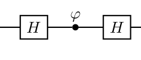

# Single qubit interference -- HPH

**Claim:** The above circuit can be represented as the product of three matrices $HPH$. We claim:

$$
HPH=
\frac{1}{\sqrt2}
\begin{bmatrix}
1 & 1 \\
1 & -1 
\end{bmatrix}
\begin{bmatrix}
1 & 0 \\
0 & e^{i\psi}
\end{bmatrix}
\frac{1}{\sqrt2}
\begin{bmatrix}
1 & 1 \\
1 & -1 
\end{bmatrix}
=
e^{i\frac{\psi}{2}}
\begin{bmatrix}
\cos{\frac{\psi}{2}} & -i \sin{\frac{\psi}{2}} \\
-i\sin{\frac{\psi}{2}} & \cos{\frac{\psi}{2}}
\end{bmatrix}
$$

**Proof:** 

Multiply

$$
\frac{1}{\sqrt2}
\begin{bmatrix}
1 & 1 \\
1 & -1 
\end{bmatrix}
\begin{bmatrix}
1 & 0 \\
0 & e^{i\psi}
\end{bmatrix}
\frac{1}{\sqrt2}
\begin{bmatrix}
1 & 1 \\
1 & -1 
\end{bmatrix}
$$

$$
=
\frac{1}{2}
\begin{bmatrix}
1 & 1 \\
1 & -1 
\end{bmatrix}
\begin{bmatrix}
1 & 1 \\
e^{i\psi} & -e^{i\psi} 
\end{bmatrix}
$$

$$
=
\frac{1}{2}
\begin{bmatrix}
1 + e^{i\psi} & 1 - e^{i\psi} \\
1 - e^{i\psi} & 1 + e^{i\psi}
\end{bmatrix}
$$

By claim [1], we can then covert to polar form:

$$
e^{i\frac{\psi}{2}}
\begin{bmatrix}
\cos{\frac{\psi}{2}} & -i \sin{\frac{\psi}{2}} \\
-i\sin{\frac{\psi}{2}} & \cos{\frac{\psi}{2}}
\end{bmatrix}
$$