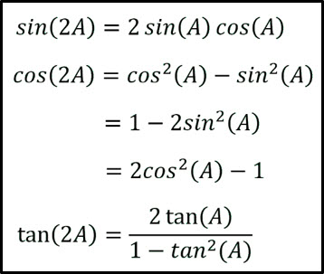

# How HPC from Claim 2 Can Be Simplified

In this note, I show how the result of Claim 2 can be simplified to reveal a clear interference term for each input and output.

\newcommand{\eipsi}{e^{i\psi}}
\newcommand{\eipsih}{e^{i\frac{\psi}{2}}}

**Claim**: From Claim 2, we have 

$$
HPH=
\frac{1}{2}
\begin{bmatrix}
1 + e^{i\psi} & 1 - e^{i\psi} \\
1 - e^{i\psi} & 1 + e^{i\psi}
\end{bmatrix}
$$

We will show $HPH$ can be simplified as:

$$
HPH
=
e^{i\frac{\psi}{2}}
\begin{bmatrix}
\cos{\frac{\psi}{2}} & -i \sin{\frac{\psi}{2}} \\
-i\sin{\frac{\psi}{2}} & \cos{\frac{\psi}{2}}
\end{bmatrix}
$$

**Proof:** To show the identity, we demonstrate the following:

1. $U_{BL} = U_{TR} = 1-\eipsi = -i2\eipsih \sin{\frac{\psi}{2}}$
2. $U_{TL} = U_{BR} = 1+\eipsi = 2\eipsih \cos{\frac{\psi}{2}}$

Where $\eipsih$ is the global phase factor.

**Showing 1:**

$$-2i\sin{\frac{\psi}{2}}\eipsih$$

Using Euler's formula [(wiki)](https://mathworld.wolfram.com/EulerFormula.html):

$$= -2i \sin{\frac{\psi}{2}}[\cos{\frac{\psi}{2}} + i\sin{\frac{\psi}{2}}]$$

$$= -i [2\sin{\frac{\psi}{2}}\cos{\frac{\psi}{2}} + 2i\sin^2{\frac{\psi}{2}}]$$

Using double angle identity: $\sin(2A)=2\cos(A)\sin(A)$

$$= -i [\sin{\psi} + 2i\sin^2{\frac{\psi}{2}}]$$

$$= 2\sin^2{\frac{\psi}{2}} - i\sin{\psi}$$

Using double angle identity: $2\sin^2(A) = 1 - \cos(2A)$

$$= 1 - \cos{\psi} - i\sin{\psi}$$

$$= 1 - [\cos{\psi} + i\sin{\psi}]$$

Using Euler's formula:

$$= 1 - e^{i\psi}$$

Therefore, we have shown $1 - e^{i\psi} = -i e^{i\frac{\psi}{2}} \sin{\frac{\psi}{2}}$

**Showing 2**

TODO: finish this part