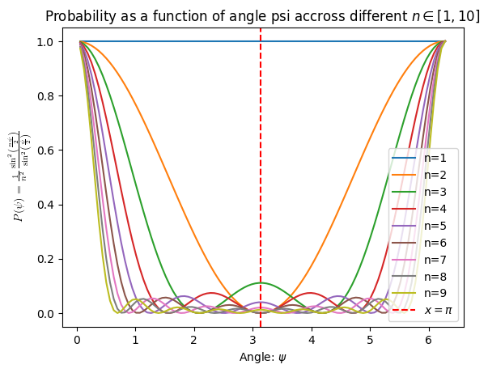

# 1.11.3 Many Computational Paths

## Part A

**Claim:** Suppose a quantum computational process, follows n different paths with each path contributing a probability amplitude of $z_k = \frac{1}{n}e^{ik\psi}$, where $\psi\in(0, 2\pi), k\in{1,\ldots,n-1}$. We claim that the total probability of realizing the final output configuration is 
$$P=\frac{1}{n^2}\frac{\sin^2 (n\frac{\psi}{2})}{\sin^2 (\frac{\psi}{2})}$$

**Proof:**
Let $z_t$ be the total complex amplitude of the final output configuration. That is:
$$z_t = \sum^{n-1}_{k=0}{z_k} $$

Plug in the value of $Z_k$ as given above:
$$ z_t = \frac{1}{n}\sum^{n-1}_{k=0}{e^{ik\psi}} = \frac{1}{n}\sum^{n-1}_{k=0}z^k$$

Using the identity $1+z+z^2+\ldots+z^n=\frac{1-z^{n+1}}{1-z}$:

$$z_t = \frac{1}{n}\frac{1-z^n}{1-z}$$

Therefore probability is:
$$P=|z|^2= |\frac{1}{n}\frac{1-z^n}{1-z}|^2 $$
$$= \frac{1}{n^2}\lvert\frac{1-e^{i\psi n}}{1-e^{i\psi}}\rvert^2$$
$$=\frac{1}{n}\frac{(1-e^{i\psi n})(1-e^{-i\psi n})}{(1-e^{i\psi})(1-e^{-i\psi})}$$

$$=\frac{1}{n^2}(\frac{2-e^{i\psi n} -e^{-i \psi n}}{2-e^{-i\psi}-e^{i\psi}})$$
$$=\frac{1}{n^2}(\frac{2-e^{i\psi n} -e^{-i \psi n}}{2-e^{-i\psi}-e^{i\psi}})$$
$$=\frac{1}{n^2}(\frac{2-[e^{i\psi n} +e^{-i \psi n}]}{2-[e^{-i\psi}+e^{i\psi}]})$$

Simplify denominator:
$$2-[e^{-i\psi}+e^{i\psi}]$$
Use $e^{i\psi}=\cos(\psi) + i\sin(\psi)$
$$=2-[\cos(-\psi)+i \sin(-\psi) + \cos(\psi)+i\sin(\psi)]$$
$$=2-[\cos(\psi)-i \sin(\psi) + \cos(\psi)+i\sin(\psi)]$$
$$=2-[\cos(\psi)+ \cos(\psi)]$$
$$=2-2\cos(\psi)$$

Simplify numerator:
$$2-[e^{-in\psi}+e^{in\psi}]=$$
$$=2-[\cos(-n\psi)+i \sin(-n\psi) + \cos(n\psi)+i\sin(n\psi)]$$
$$=2-[\cos(n\psi)+ \cos(n\psi) + i\sin(n\psi) -i \sin(n\psi) ]$$
$$=2-2\cos(n\psi)$$

Plug back in to get:
$$P=|z|^2 =\frac{1}{n^2}\frac{2-2\cos(n\psi)}{2-2\cos(\psi)}$$

[Note: See trig identities for modulus of complex number](https://mathworld.wolfram.com/AbsoluteSquare.html)

Use the trig identity: $\cos(\theta) = 1 - 2\sin^2\left(\frac{\theta}{2}\right)$

$$P=|z|^2 =\frac{1}{n^2}\frac{2-2[1-2\sin^2\left(\frac{n\psi}{2}\right)]}{2-2[1-2\sin^2\left(\frac{\psi}{2}\right)]}$$

$$=\frac{1}{n^2}\frac{4\sin^2\left(\frac{n\psi}{2}\right)}{4\sin^2\left(\frac{\psi}{2}\right)}$$
$$=\frac{1}{n^2}\frac{\sin^2\left(\frac{n\psi}{2}\right)}{\sin^2\left(\frac{\psi}{2}\right)}$$

Therefore the total probability from all paths is:
$$P=\frac{1}{n^2}\frac{\sin^2 (n\frac{\psi}{2})}{\sin^2 (\frac{\psi}{2})}$$

## Part B

When the relative angle is zero we have $\psi = 0$, the probability is $P=1$ as shown below in the graph.

## Part C

We can see the probability reaches zero at $\psi=\pi$

Plot:

